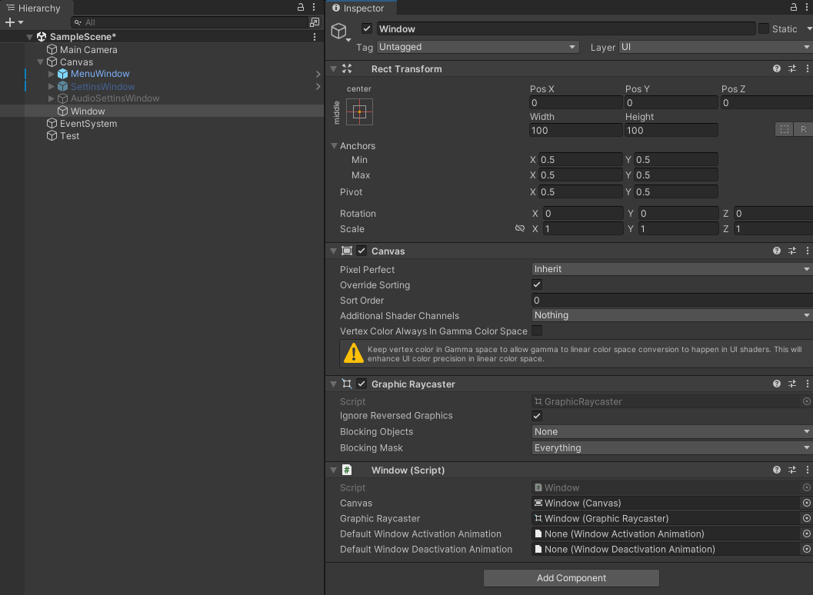

# Window - окно

Класс `Window` - это ядро всей системы, он представляет окно, которое имеет возможность показа или скрытия. Все ваши окна так или иначе должны наследоваться от `WIndow`, однако вы также можете использовать его напрямую. 

Всякое окно имеет свой собственный `Canvas`, благодаря которому можно определять порядок этого окна относительно других окон. По этой причине `Canvas` и `GraphicRaycaster` являются обязательными и будут добавлены автоматически.

<aside>
💡

У Canvas должен быть включен режим `Override Sorting`.

</aside>



В инспекторе класс Window отобразит следующие поля: 

- `Canvas` - канвас текущего окна.
- `GraphicRaycaster` - рейкастер текущего окна.
- `DefaultWindowActivationAnimation` - анимация активации по умолчанию.
- `DefaultWindowDeactivationAnimation` - анимация деактивации по умолчанию.

# API работы с окном

Данный класс обладает следующими публичными членами:

- `Canvas` - ссылка на свой канвас.
- `GraphicRaycaster` - ссылка на свой рейкастер.
- `Activate(...)` - метод активирующий окно. Вернет корутину этого процесса.
- `Activating` - событие начала активации.
- `Activated` - событие конца активации.
- `Deactivate(...)` - метод деактивирующий окно. Вернет корутину этого процесса.
- `Deactivating` - событие начала деактивации.
- `Deactivated` - событие конца деактивации.
- `IsInTransition` - вернет true, если окно в данный момент активируется или деактивируется.

Примеры работы с окном:

```csharp
// Запускаем активацию окна и ждем окончания.
yield return window.Activate();
```

```csharp
// Подписываемся на события окна.
window.Activating += window => print($"Window {window.GetType().Name} is activating");
window.Activated += window => print($"Window {window.GetType().Name} is activated");
window.Deactivating += window => print($"Window {window.GetType().Name} is deactivating");
window.Deactivated += window => print($"Window {window.GetType().Name} is deactivated");

// Активируем окно, ждем пока анимация завершится и деактивируем.
window.Activate();
yield return new WaitWhile(() => window.IsInTransition);
window.Deactivate();
```

```csharp
// Методы Activate и Deactivate принимают необязательные параметры:
// 1. Нужно ли использовать реальное время вместо игрового.
// 2. Анимация активация (для Activate) или деактивации (для Deactivate).
// 3. Владелец корутины активации (для Activate) или деактивации (для Deactivate).
yield return window.Activate(false, activationAnimation, this);
yield return window.Deactivate(false, activationAnimation, this);
```

# Наследование от Window

Вы можете объявить свой класс и наследовать его от WIndow, чтобы тот получил всю необходимую логику. При наследовании вы можете переопределить следующие методы:

- `OnInstantiated` - вызывается `WindowManager`’ом в момент когда он создает новое окно.
- `OnActivating` - вызывается перед активацией окна.
- `OnActivated` - вызывается после активации окна.
- `OnDeactivating` - вызывается перед деактивацией окна.
- `OnDeactivated` - вызывается после деактивации окна.

Все эти методы по умолчанию имеют пустое тело в классе `Window`, вы можете написать в них нужную вам логику в вашем наследованном классе.

Помимо этих методов, вы также можете переопределить более важные методы:

- `Activate` - активирует окно.
- `ActivateEnumerator` - представляет корутину активации окна.
- `Deactivate` - деактивирует объект.
- `DeactivateEnumerator` - представляет корутину деактивации окна.

Пример наследования:

```csharp
public class MenuWindow : Window
{
		// Вызовется менеджером окон один раз, в момент инстанциации окна.
    protected override void OnInstantiated() => Initialize();
    
    // Будет вызываться всякий раз при старте показа окна.
    protected override void OnActivating() => UpdateUIState();
    
    // ...
}
```

# Наследование от FadingWindow

В некоторых случаях удобно иметь `CanvasGroup` у окна, так как он позволяет легко управлять видимостью и интерактивностью окна. Для такого случая лучше наследоваться от **`FadingWindow`** класса. 

Данный класс является наследником `Window` и автоматически обрабатывает  `CanvasGroup` окна, а именно, в процессе переключения состояния окна с активного на неактивный или наоборот, он автоматически будет переключать `CanvasGroup.blockRaycasts` в состояние `false`, чтобы нельзя было кликать по интерактивным элементам. 

Вот исходный код данного класса.

```csharp
using UnityEngine;

namespace Azur.WindowsSystem
{
    [RequireComponent(typeof(CanvasGroup))]
    public class FadingWindow : Window
    {
        [SerializeField] protected CanvasGroup _canvasGroup;

        public CanvasGroup CanvasGroup => _canvasGroup;

        protected override void Reset()
        {
            base.Reset();
            _canvasGroup = GetComponent<CanvasGroup>();
            _canvasGroup.blocksRaycasts = false;
        }

        protected override void OnActivating() => _canvasGroup.blocksRaycasts = false;

        protected override void OnActivated() => _canvasGroup.blocksRaycasts = true;
        
        protected override void OnDeactivating() => _canvasGroup.blocksRaycasts = false;

        protected override void OnDeactivated() => _canvasGroup.blocksRaycasts = true;

    }
}
```